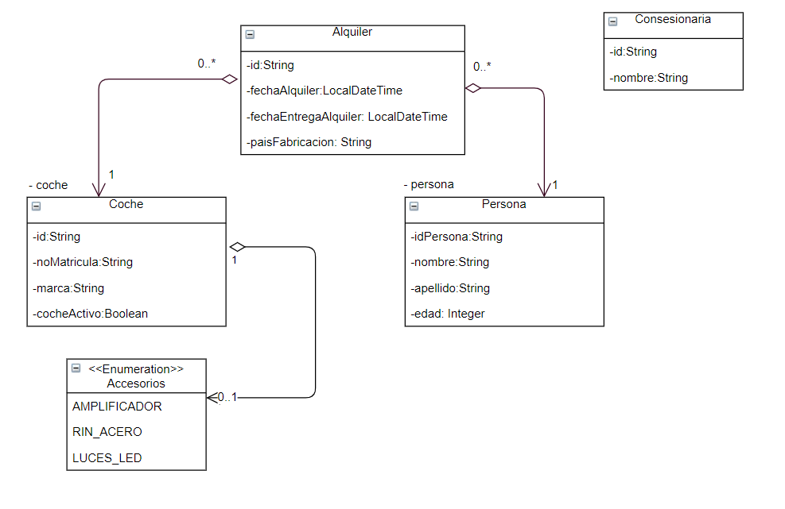

# Arquitectura de un mini API-Rest simulado
> Este proyecto pretende ser un ejemplo sencillo de arquitectura de un API-Rest simulado para comprender las capas que intervienen y la organización de los diferentes tipos de test, con integración continua y control de la calidad del código
> #### [Máster en Ingeniería Web por la Universidad Politécnica de Madrid (miw-upm)](http://miw.etsisi.upm.es)
> #### Asignatura: *Arquitectura y Patrones para Aplicaciones Web*

## Tecnologías necesarias
* Java
* Maven
* GitHub

## Diseño de entidades

### Responsabilidades
#### Dispatcher
* Centraliza las peticiones y hace de repartidor
* Recupera los datos de la petición y los pasa como parámetros de método
* Captura las excepciones y las convierte en errores Http
#### restControllers
* Define el path del recurso
* Valida la entrada
* Traspasa la petición a los controladores de la capa de negocio
#### businessControllers
* Procesa la petición, apoyándose en los DAO’s
* Crea las entidades a partir de los DTO’s
* Gestiona la respuesta a partir de las entidades. Delega en los DTO’s la creación a partir de la entidad
#### daos
* Gestionan la BD
#### entities
* Son las entidades persistentes en la BD

## API

### POST /coches
#### Parámetros del cuerpo
- `noMatricula`: String
- `marca`: String (**requerido**)
- `cocheActivo`:  Boolean
- `accesorio`:  String
#### Respuesta
- 200 OK
  - `id`: String
- 400 BAD_REQUEST

---
### PUT /coches/{id}
#### Parámetros del cuerpo
- `id`: String (**requerido**)
- `marca`: String (**requerido**)
- `noMatricula`: String
- `cocheActivo`: Boolean
- `accesorio`: String

#### Respuesta
- 200 OK
- 400 BAD_REQUEST
- 404 NOT_FOUND
---
### PUT /personas/{id}
#### Parámetros del cuerpo
- `id`: String (**requerido**)
- `nombre`: String (**requerido**)
- `apellido`: String
- `edad`: Integer

#### Respuesta
- 200 OK
- 400 BAD_REQUEST
- 404 NOT_FOUND
---
### DELETE /alquilers/{id}
#### Respuesta
- 200 OK 
---
### POST /personas
#### Parámetros del cuerpo
- `name`: String (**requerido**)
- `apellido`: String (**requerido**)
- `edad`: Integer (**requerido**)
#### Respuesta
- 200 OK
- `id`: String
- 400 BAD_REQUEST
---
### GET /alquilers
#### Respuesta
- 200 OK 
  - `{fechaAlquiler:LocalDateTime, fechaEntrega:LocalDateTime, paisFabricacion:String, persona{nombre:String, apellido:String, edad:Integer}, coche{marca:String, paisFabricacion}}`
- 403 BAD_REQUEST
- 404 NOT_FOUND
---
### PATCH /coches/{id}/accesorios
#### Parámetros del cuerpo
- `accesorio`: String (**requerido**)
#### Respuesta
- 200 OK 
- 403 BAD_REQUEST
- 404 NOT_FOUND
---
### GET /coches/search?q=accesorios:{RIN_ACERO}
#### Respuesta
- 200 OK
  - `[{id:String,noMatricula:String,marca:String,cocheActivo=String, accesorio=String}]`
- 400 BAD_REQUEST
---
##### Autor: Freddy Tandazo Yánez U.P.M.
